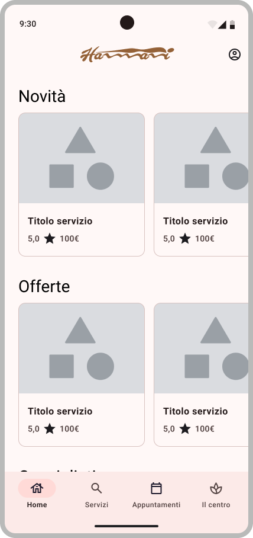
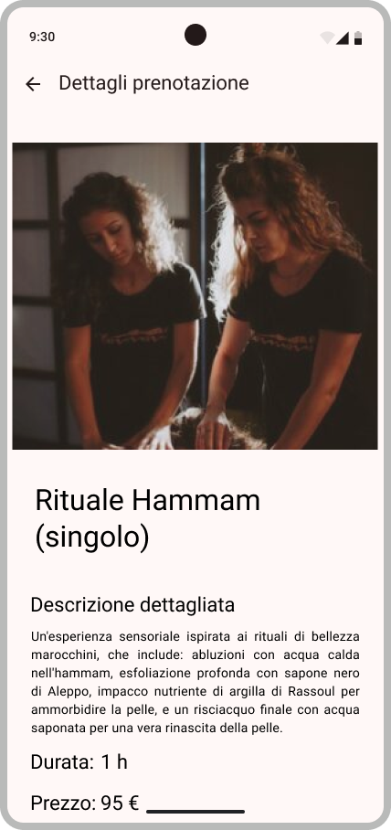
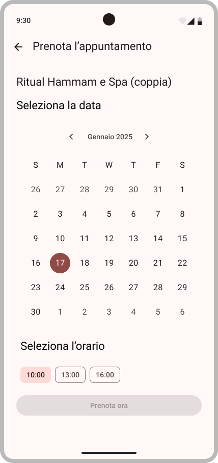
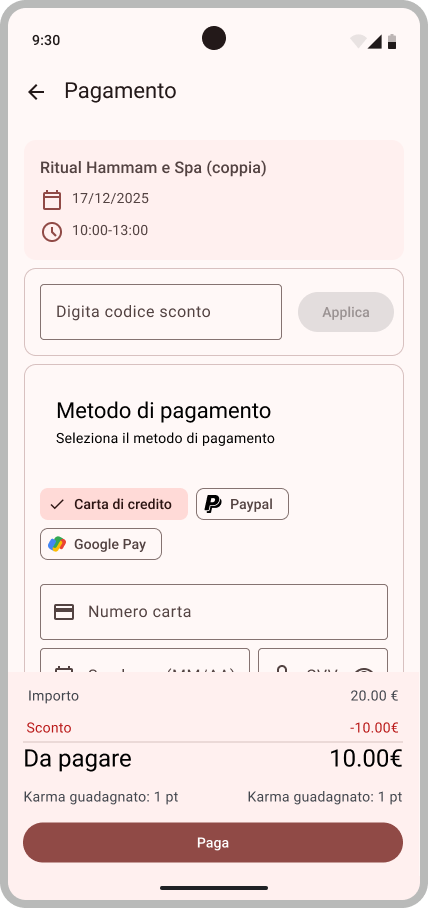
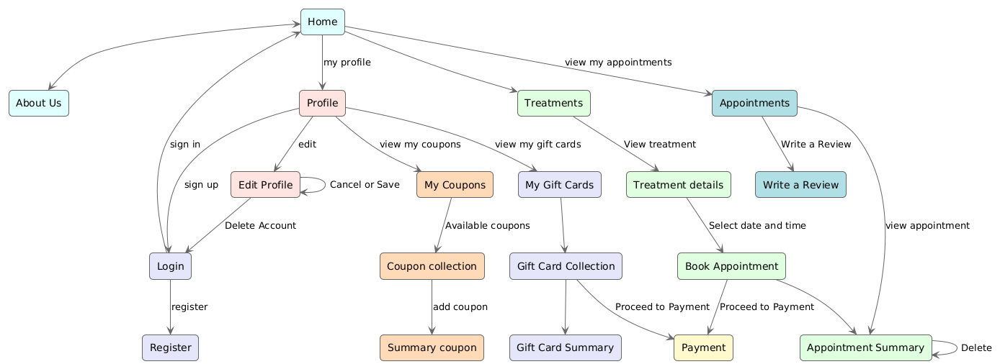

# Hammami Wellness App - Android Nativo (Kotlin)

Un'applicazione mobile nativa per Android, sviluppata in **Kotlin**, il cui design è stato interamente guidato da un processo di **Human-Centered Design (HCD)**. Utilizzando **Material Design 3**, l'app consente agli utenti di esplorare servizi, prenotare trattamenti, gestire il proprio profilo e interagire con il centro benessere attraverso un'interfaccia intuitiva e accessibile.

---

### 📄 **Documentazione Completa**
* [**Esplora il Prototipo Interattivo su Figma**](https://www.figma.com/design/7mJzNG0WF3RerFoHGTPknW/Material-3-Design-Kit--Community-?node-id=55908-54774&t=YZoReQabeNy1w2rK-1)
*   [**Leggi la Relazione di Progetto Completa**](./relazione-hammami.pdf)
*   [**Visualizza le Slide di Presentazione**](./slide-presentazione-hammami.pdf)

---

## ✨ Feature Principali

| Homepage & Servizi | Dettaglio Servizio | Calendario Prenotazione | Pagamento |
| :---: | :---: | :---: | :---: |
|  |  |  |  |

*(Una panoramica visiva del flusso utente principale: dalla scoperta del servizio al pagamento.)*

*(Una panoramica visiva delle funzionalità chiave dell'applicazione.)*

## 🗺️ Architettura dell'Informazione e Flussi Utente

Prima dello sviluppo, l'intera architettura di navigazione è stata mappata per garantire un'esperienza utente logica e intuitiva. Il diagramma seguente illustra i principali flussi di navigazione dal punto di vista del cliente.

## 🏛️ Architettura e Stack Tecnologico

L'applicazione è costruita su un'architettura moderna, robusta e scalabile, seguendo le best practice dello sviluppo Android.

*   **Linguaggio:** **Kotlin** (100% nativo)
*   **Architettura:** **MVVM (Model-View-ViewModel)** per una chiara separazione delle responsabilità.
*   **UI Toolkit:** **Android Jetpack** con `Fragments` e `Navigation Component` per una navigazione a Single-Activity.
*   **Backend (BaaS):** **Google Firebase** (Firestore, Authentication, Storage).
*   **Dependency Injection:** **Hilt** per gestire le dipendenze in modo efficiente.
*   **Gestione degli Errori:** Strategia strutturata su più livelli (Domain, Data, Presentation) per garantire la robustezza dell'app.

## 🎨 Processo di UX/UI Design

Il progetto è nato da un approfondito processo di User Research e Human-Centered Design:

1.  **User Research & Analisi dei Competitor:** Conduzione di questionari e analisi di mercato.
2.  **Creazione di Personas:** Sviluppo di profili utente realistici per guidare il design.
3.  **Prototipazione su Figma:** Realizzazione di mockup interattivi per validare i flussi utente.
4.  **Aderenza a Design System:** Implementazione basata sui principi di **Material Design 3**.
